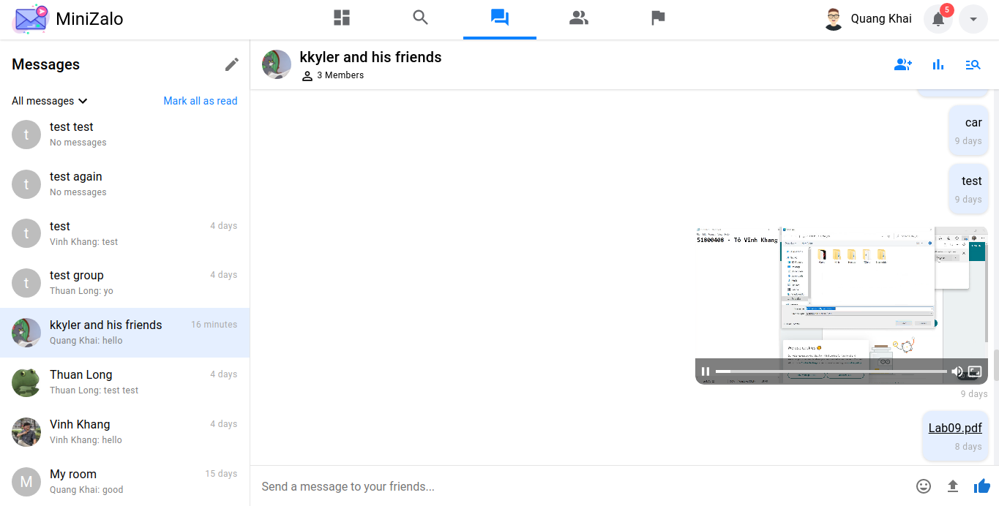

# MiniZalo

@Authors: To Vinh Khang, Bui Quang Khai, Du Thuan Long

## Description

MiniZalo is a web chat that inspired by Zalo and Facebook, it's also a university project of I and my friends about implementing SignalR of ASP .NET Core to build a real-time web chat. Wel also have added some additional features to make it more awesome.

## Screenshots

### Dashboard

  

### Search for friends

  

  

  

### Experience chat with emoji

  

### Upload video & document

  

### Zoom or view the original size of your image

  

### Create group messaging

  

  

### View your friends list

You can also start messaging with your friend from here.

  

### Copyright

  

### User settings

  

> NOTE: We are now working on notification, friend request confirmation, user settings and more...

---

Powered by KKL Software Team
