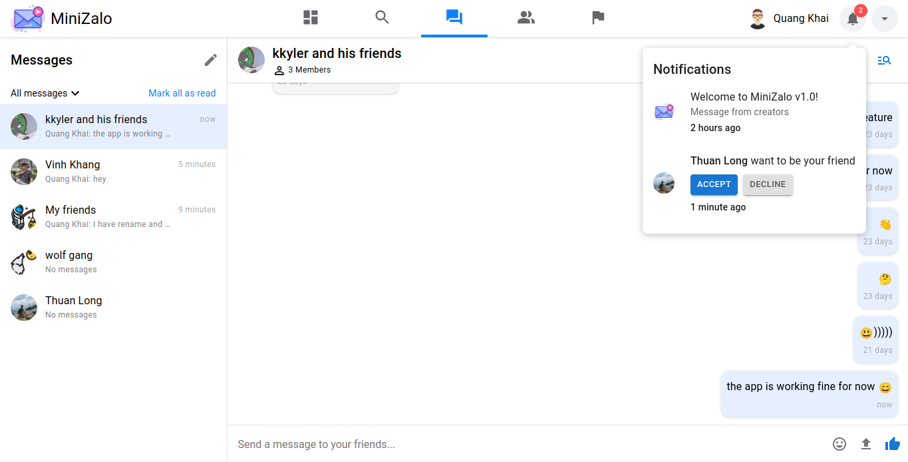

<!-- Introduction -->

  
  

<h3 align="center">Simple web chat inspired by Zalo and Facebook</h3>

@Authors: To Vinh Khang, Bui Quang Khai, Du Thuan Long

 

  
  
  

  
  

 

  

 

MiniZalo is a web chat created by I and my friends, it is also our university project about implementing SignalR of ASP.NET Core to build a web chat. We have collected some ideas and features from Zalo and Facebook to make our project more awesome 🎉.

<!-- End of introduction -->

<!-- Features -->

## ✨ Features

### Experience with emoji

  

### Upload image, video & document

The upload handler will only accept the following file extensions:

- All extensions of image
- All extensions of video
- Document & archive: `.doc`, `.docx`, `.xls`, `.xlsx`, `.txt`, `.pdf`, `.rar`, `.zip`

#### Upload image

  

  

#### Upload video

  

  

#### Upload document

  

  

### Image, video & document features

#### Zoom or view the original size of your image

  

#### Upload limit is 10mb

  

### Create group chat

- Choose the pencil icon above of the inbox list to start creating your new group
- Add your group an avatar (optional)
- Add your friends as members of the group

  

  

### Search for friends

  

  

  

### View friends & direct message

  

  

### View notifications

  

<!-- End of features -->

<!-- Notes -->

## 📋 NOTE

We are still working on notifications, friend request confirmation, user profile and more...

---

Powered by KKL Software Team

<!-- End of notes -->
