# MiniZalo

@Authors: To Vinh Khang, Bui Quang Khai, Du Thuan Long

## Description

MiniZalo is a web chat that inspired by Zalo and Facebook, it's also a university project of I and my friends about implementing SignalR of ASP .NET Core to build a real-time web chat. Wel also have added some additional features to make it more awesome.

> MiniZalo is still under development.

## Demo

**Dashboard**

  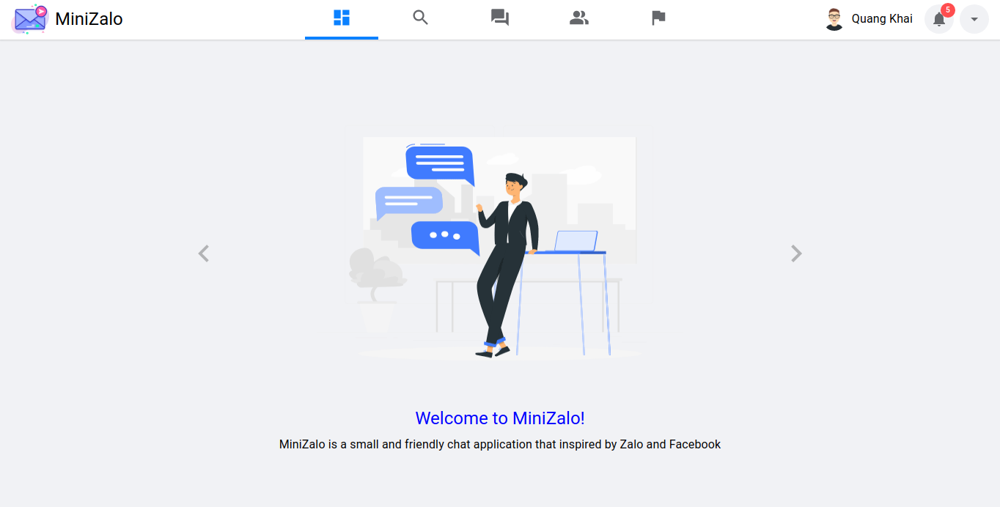

 

**Search for friends**

  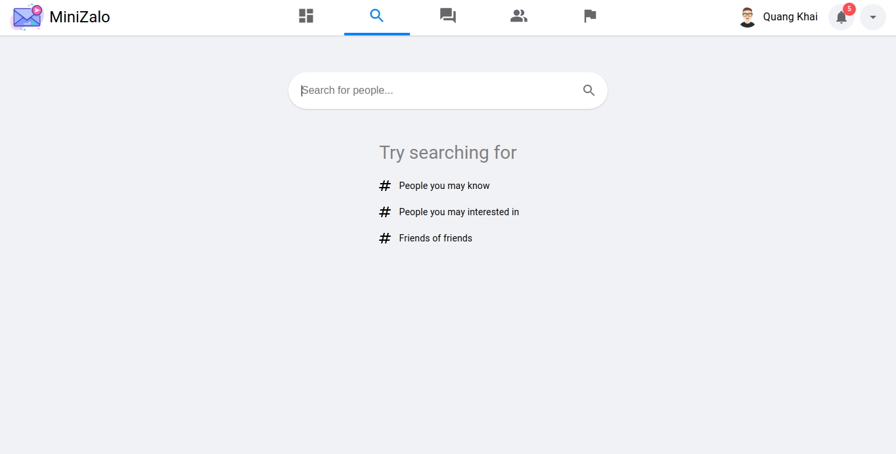

  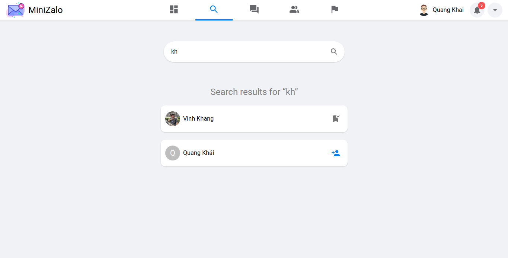

  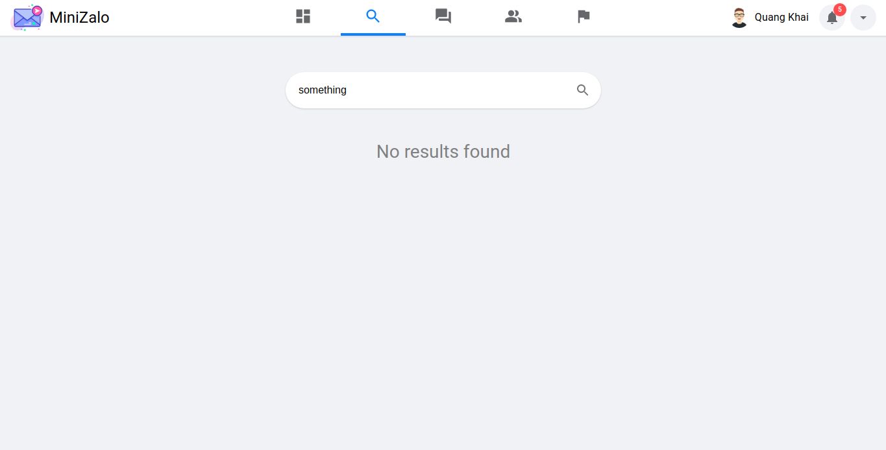

 

**Experience chat with emoji**

  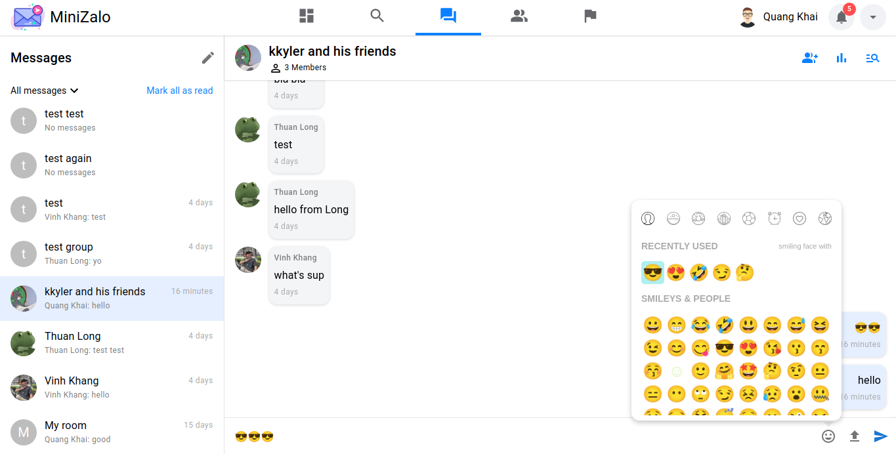

 

**Upload video & document**

  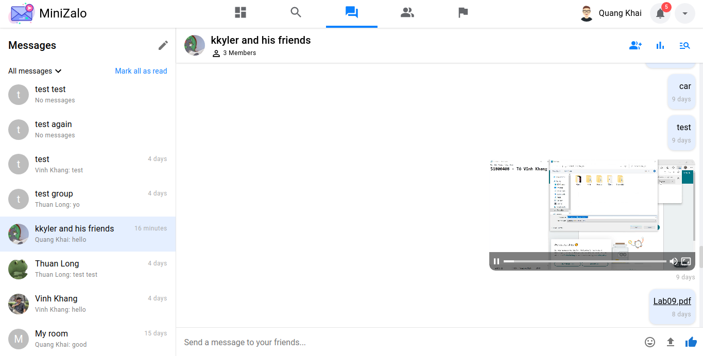

 

**Zoom or view the original size of your image**

  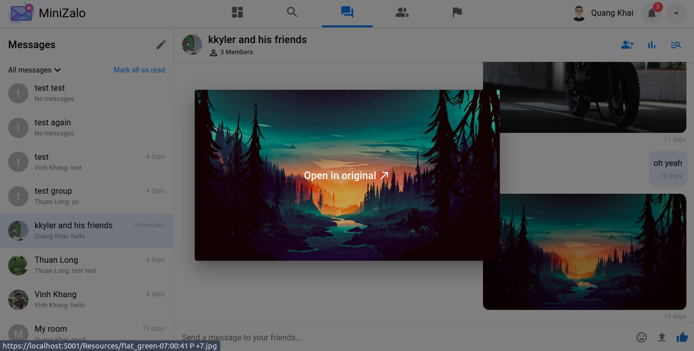

 

**Create group messaging**

  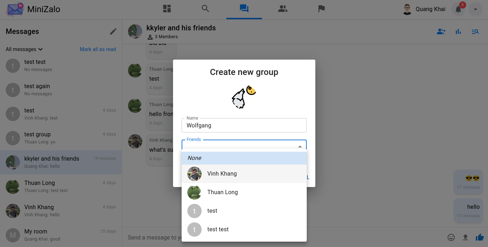

  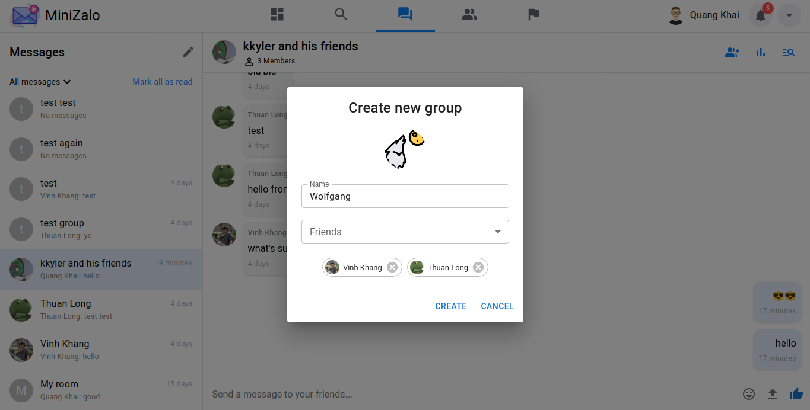

 

**View your friends list**
You can also start direct messaging with your friend.

  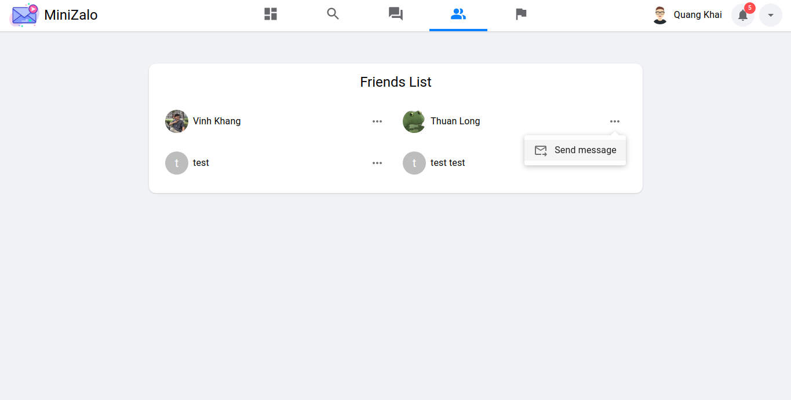

 

**Copyright**

  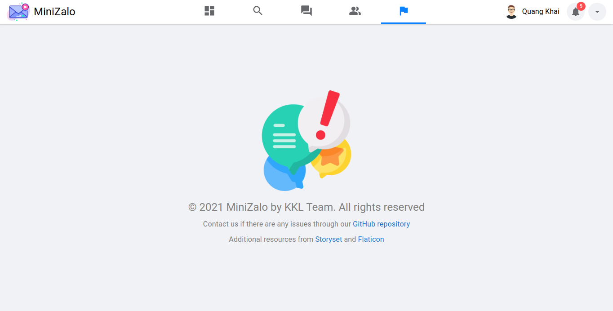

 

**User settings**

  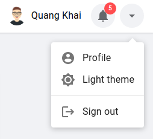

NOTE: A lot of cool features are still in development and will be release in the future. Besides, we also have to fix some issues :(

---

Powered by KKL Software Team
