# MiniZalo

@Authors: To Vinh Khang, Bui Quang Khai, Du Thuan Long

## Description

MiniZalo is a web chat that inspired by Zalo and Facebook, it's also a university project of I and my friends about implementing SignalR of ASP .NET Core to build a real-time web chat. We also have added some additional features to make it more awesome.

## Screenshots

### Dashboard

  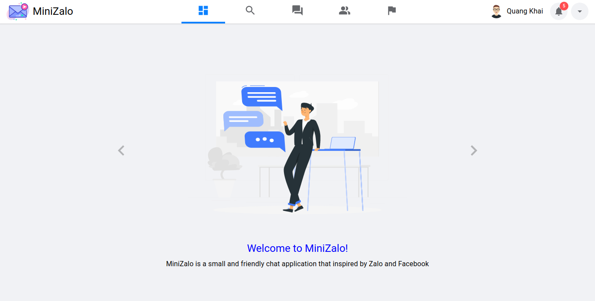

### Search for friends

  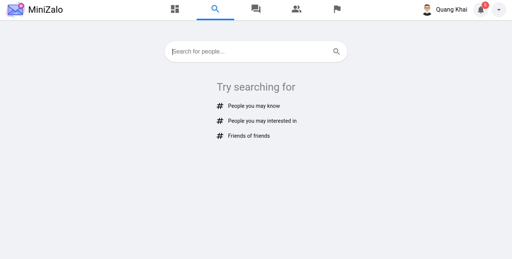

  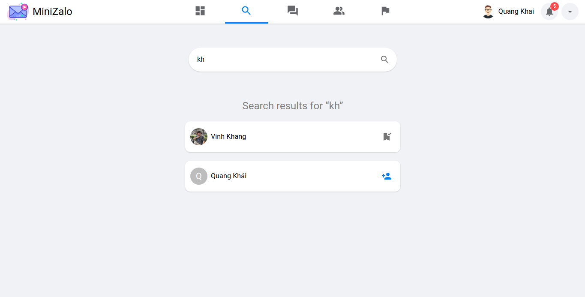

  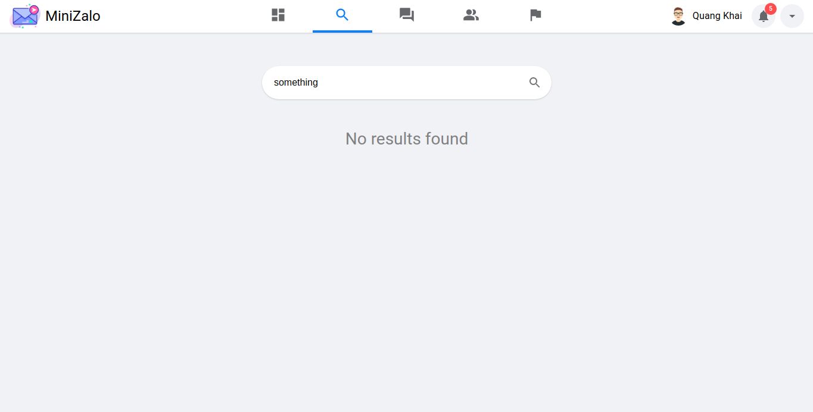

### Experience chat with emoji

  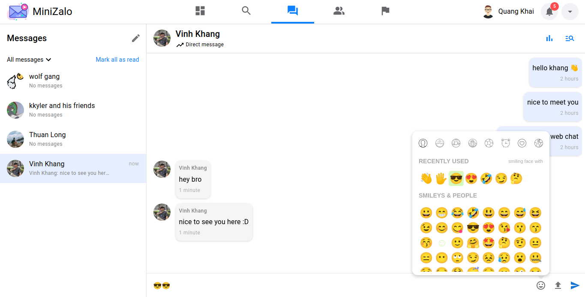

### Upload image, video & document

#### Image

  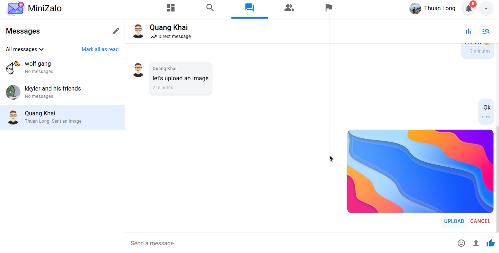

  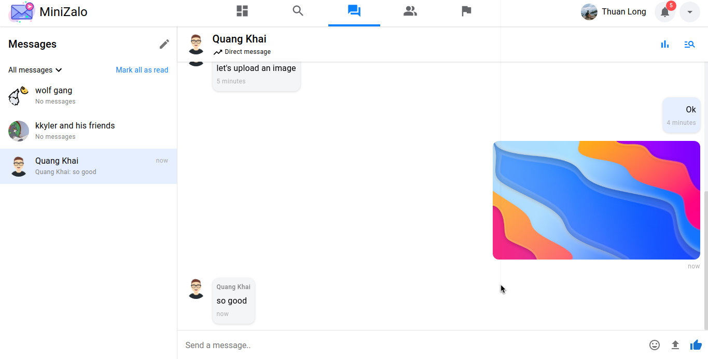

#### Video

  

  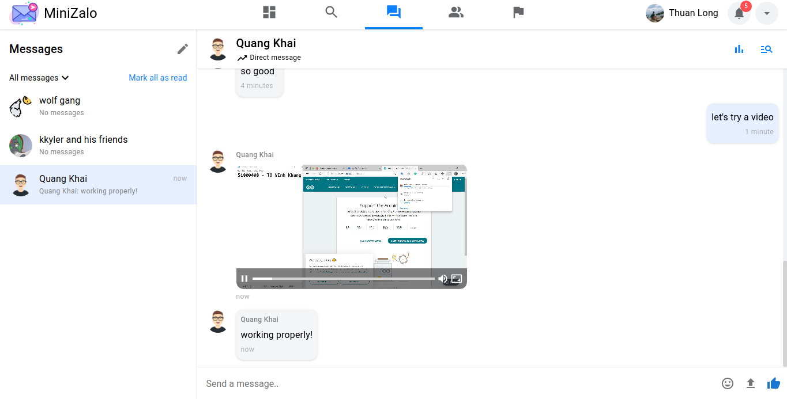

#### Document

  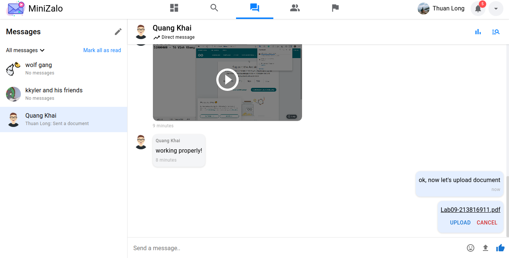

  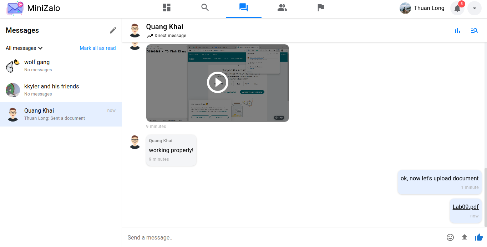

### Image, video & document features

#### Zoom or view the original size of your image

  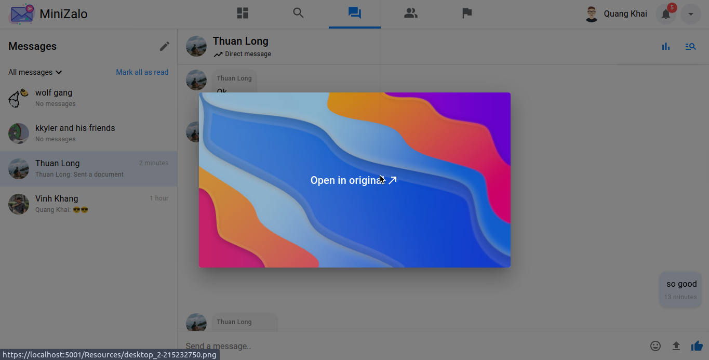

#### Pause, mute or open video in full screen

  

#### Upload limit is 10mb

  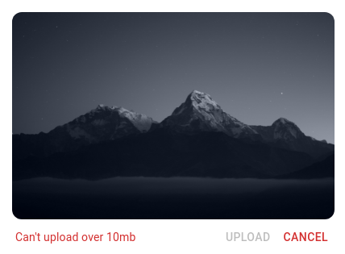

### Create group chat

- Choose the pencil icon above of the inboxes list to start creating your new group.
- You can add your group an avatar (optional).
- You can only add your friends as members of the group.

  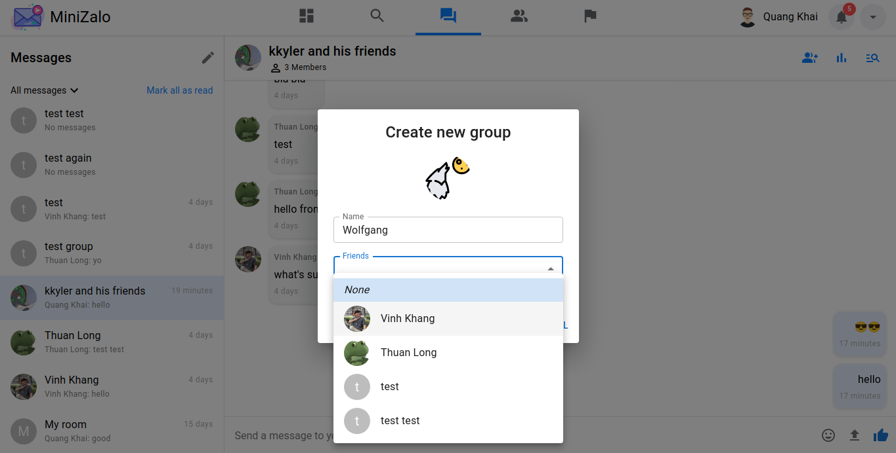

  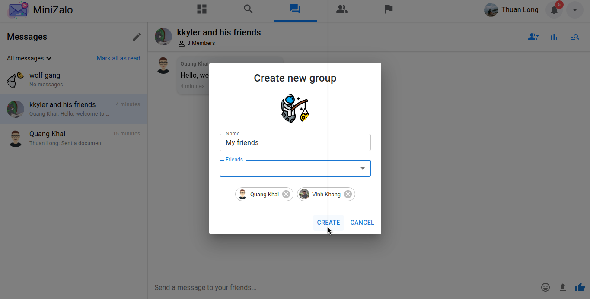

### Friends

#### View friends list

  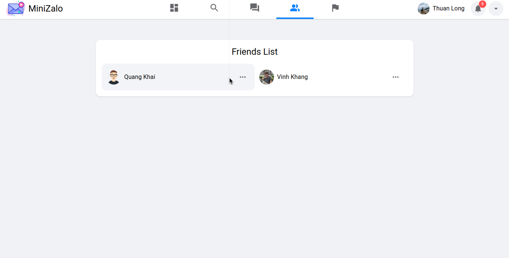

#### Message with your friend

  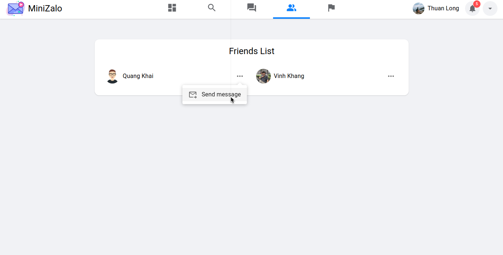

### Copyright

  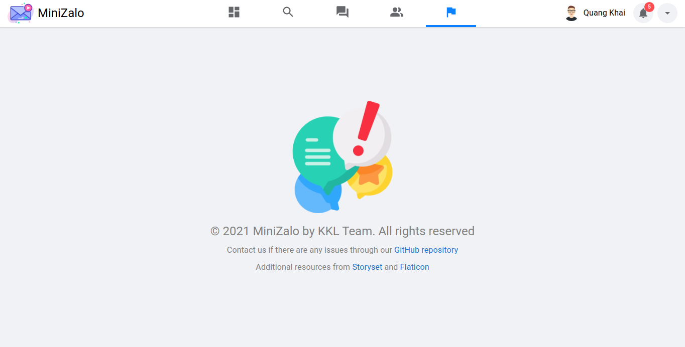

### User settings

  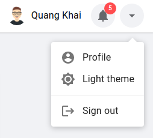

## NOTE

We are still working on notification, friend request confirmation, user settings and more...

---

Powered by KKL Software Team
