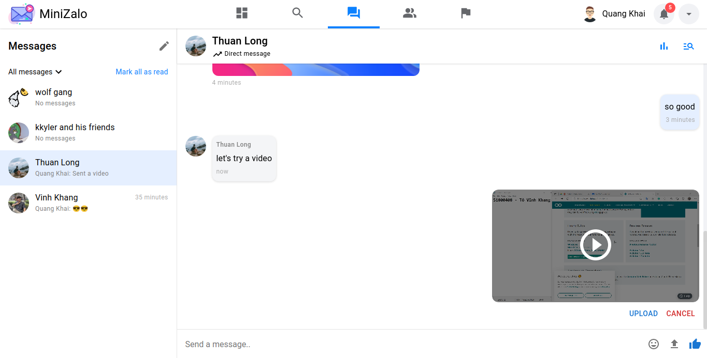

# MiniZalo

@Authors: To Vinh Khang, Bui Quang Khai, Du Thuan Long

## Description

MiniZalo is a web chat that inspired by Zalo and Facebook, it's also a university project of I and my friends about implementing SignalR of ASP .NET Core to build a web chat.

## Overview

### Dashboard

  

### Search for friends

  

  

  

### Chat

#### Experience with emoji

  

#### Upload image, video & document

The upload handler will only accept the following file extensions:

- All extensions of image
- All extensions of video
- Document & archive: `.doc`, `.docx`, `.xls`, `.xlsx`, `.txt`, `.pdf`, `.rar`, `.zip`

##### Upload image

  

  

##### Upload video

  

  

##### Upload document

  

  

#### Image, video & document features

##### Zoom or view the original size of your image

  

##### Upload limit is 10mb

  

#### Create group chat

- Choose the pencil icon above of the inbox list to start creating your new group
- Add your group an avatar (optional)
- Add your friends as members of the group

  

  

### Friends

#### View friends

  

#### Message with your friends

  

### Notifications

#### View notifications

  

## NOTE

We are still working on notifications, friend request confirmation, user settings and more...

---

Powered by KKL Software Team
